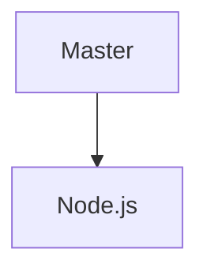

### Node.js By DHIMANvivek

Notes

	

    
  

	
	

#### Start

  <a>
  * Node js Master  

-> nodejs 8.0.0 lts -> long term stable 

* Story On Nodejs

Creator of Node.js - > Ryan Dahl 

running javascript on the server 

v8 like chrome is strong virtual machine 

setTimeout( function() { } , 2000) -> in this first argument is callback function and second argument is the number of miliseconds you want to wait

setInterval( function() { } , 2000) -> callback function calls again and again like function() { console.log(" Hello ")} -> Hello get print again and again

node.js exits when there is nothing to do 

stop -> https://www.youtube.com/watch?v=jo_B4LTHi3I        11.43 time

course continue ->

in jan 2010 -> isaac schlueter created NPM

in feb 2009  -> MongoDB was created 

noSql database 

php developers using mysql

data store in binary form of json 

api -> json became problem 

everyone had to learn how to store and manipulate json

node.js and mongo made working with json on the backend much easier

javascript object notation more commonly known by the acronym JSON is an open data interchange format that is both human and machine-readable. it is independent of any programming language and is a common API output in a wide variety of applications.

json is native constructs 

nested object structure 

node was just js

keys values and nested objects 

javascript on the server 

expressjs , mongoose , angularJs , node for windows 

google release angular 2 way binding

mean stack developer 

node is needed at the end 

from 2011 until now node has progressed in largely predictable ways.

* V8 

= the chrome v8 javascript engine 

modern computers only understand "machine code"

instead of writing machine code most devs write in "high level" languages

in order to execute high-level code , the computer uses:

- interpreters 
- compilers 
- transpilers

compilers -> take source code and turn it into an executable file ( a file full of code the computer can execute ) 

transpilers -> take source code and turn it into source code of another type.

turning coffeescript into javascript

interpreters -> take source code and directly execute it by taking intermediate steps but they don't leave anything behind

v8 is javascript engine ( which is a type of javascript interpreter )

v8 is inside of chrome

Other javascript engines :

javascriptCore ( iOS , safari )
SpiderMonkey developed by mozila ( Firefox )
Chakra ( Internet Explorer )

javascript developed by Brendan Eich

web browsers embed javascript engines in oder to execute js.

node.js does the same. it embeds v8 in order to execute js.

what is node js exactly ?

->> node.js is server-side javascript runtime environment

v8 is cars engine 
node.js is everything else that makes the car/
you are driver

node.js is c++ application that embeds the v8 js engine

nodejs now presents itself as two applications :

1. A script processor 
2. A REPL ( Read Eval Print Loop )

call the script processor with:

node {script name}

node index.js

node is simply pass your javascript to v8 it initialize the process called event loop 

the "event loop" is continually checking if there is any new for node.js to do.

synchronous behaviour are executed completed by node as soon as possible

asynchronous behaviour are simply invoked but not imediated completed

node.js is single threaded 

node's event loop and "non blocking" IO don't allow node to do multiple things at one time....

..they just allow node to schedule things later

when processing a request, most web apps are actually sitting around waiting for most of the time.

blocking methods execute synchronously and non blocking methods execute asynchronously

a non blocking IO allows an app to do other things while its sitting around waiting

and thats how node processes js.

when you run a node application you dont specify all the files in the app , you only secify the "entry file".

var lib = require('./lib');

this grabs the contents of one file and assigns it to a variable.

module.exports = whatever ; 

this makes the current file "export" something to any other file who "requires" this one.

ex:-

nodes module system creates a dependency tree, which tells node which files are needed to run the application

in summary : nodes script processor :

Reads in the file you specify
Reads in all the dependencies that file specifies, and all the dependencies of those files etc.
Begins executing the synchronous tasks in those files.
Begins processing the todo list by repeating the event loop until it has nothing to do.

REPL ->  Read Eval Print Loop -> it works like a console inside our browser , it is a way to define execute javascript code against the v8 engine in realtime 

to invoke REPL , just enter node

Anatomy of a Node Application ->>

comments 

dependencies -> when you want to import something like -> var mathlib = require('./lib/math')

you dont need to use the extension of the file name like math.js above written as math only this is the convinience that node provides.

objects ->

var jokes = {};

jokes.allJokes = function() { };

// export the library

module.exports = jokes ;

var fs = require('fs');

fs is a module that come standards with nodejs as part of there api we dont need to download it but you need to import it.

app.config = {
 'time' : 1000
}

app.config.time

Object literal notation -> object literals can also contain other object literals as well as functions like ->

const person = {
  name: 'vivek',

	greet: function() {
 		console.log('hello'+ this.name);
  }
}

Common Node Conventions -> 
 
package.json -> 

it contains meta data of the project this include the : 

{
  "name": "basicExample",
  "version": "0.0.1",
  "license": "UNLICENSED",
  "private": "true",
  "description": "Simple file that declares a few functions and invokes them",
  "main": "index.js",
  "scripts": {
    "start": "node index.js"
  },
  "dependencies": {
    "jokes" : "0.1.3"
  }
}

common node convention ->

hidden file called .npmrc -> it just contain a token to authenticate the project against the npm cloud

* Testing and task running -> are both quite popular in the node community , testing script are commonly held in a /test directory and are triggered by a "test runner" such as mocha. Mocha is a testing library for Node. js, created to be a simple, extensible, and fast. It's used for unit and integration testing.

Grunt and Gulp are two most popular task runners

Grunt uses data configuration files that are similar to JSON, whereas Gulp employs JavaScript, which tends to be easier to write. Gulp code is often much shorter than Grunt code, and part of this is because you have to declare source and destination files for every task in Grunt.

* Documentation and source Control ->

readme.md

.git

.gitignore

common code-comments :-

@param -> To comment on a parameter, start the line with @param

/**
 * Prints "Hello!" to the console a given number of times
 * @param count the number of times to print the phrase
 */

@todo
@author
@date

* Environments & Configurations

oPTION 1:

start your app with -> NODE_ENV=myEnvironmentName node index.js

put your configuration in a file ( eg. config.js )
which has a switch inside of it.

that switch should read process.env.NODE_ENV to determine the current environment and export only the config variable for that environment

process.env.NODE_ENV is a special environment variable in Node.js that is used to determine the current environment in which the application is running.

OPTION 2:

start your app with every configuration varible you are going to need for that environment:

DBpassword=myDBpassword apiToken=mySecretToken port=thePortIShouldRunOn foo=bar node index.js

OPTION 3:

Read all your configuration from a .env file which gets ignored by source control

Each dev would put their own .env file in the project prior to beginning localhost work/

your deployment pipeline would insert an .env file into the repo before it deploys anywhere

* Styles & Patterns 

Airbnb Javascript Style Guide()

* Error Handling 

Errback:
function should callback two parameters
1. an error (if any)
2. data being returned (if any)

exampleFunction(function(err,data){
      //check error
      //Do stuff with the data
});

Avoid throwing Exceptions 

An uncaught exception takes down the thread and kills the app

Avoid Globals -> this way you will avoid namespace collisions with any libraries you may be using 

* Node.js vs Browser / Window

node can do many things that frontend js can not

node is one environment 

the browser is many

in node the source code you write is not visible to the end user
  </a>
	

